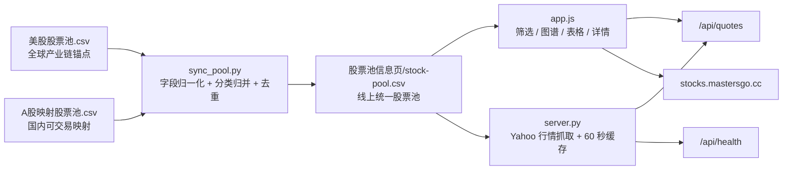

# 线上股票池与美股 / A 股映射实现说明

更新日期：2026-06-23 16:49 CST   
线上地址：<https://stocks.mastersgo.cc>

## 1. 这套系统解决什么问题

这套线上股票池不是简单的“代码列表”，而是一个面向 AI 产业链研究的混合市场观察系统。它同时承载三件事：

1. 维护一份美股研究池，作为全球 AI 产业链的主框架。
2. 维护一份 A 股映射池，把国内标的映射到美股产业链锚点、海外可比公司或主题驱动因子。
3. 在线上页面中，把美股和 A 股放进同一个可筛选、可看行情、可看关系图谱的研究地图。

一句话概括：

> 美股池定义“全球产业链骨架”，A 股池定义“中国可交易映射”，线上页把两者合并成一个市场感知、行情实时刷新、关系可视化的研究宇宙。

## 2. 当前线上状态

截至 2026-06-23 16:47 CST 重新核对，正式线上页状态如下：

| 项目 | 当前值 |
|---|---:|
| 线上股票池总数 | 103 |
| 美股 | 59 |
| A 股 | 44 |
| 行情接口请求数 | 103 |
| 行情接口返回数 | 103 |
| 缺失行情 | 0 |
| 行情来源 | Yahoo Finance chart endpoint |
| 缓存周期 | 60 秒 |

需要特别注意：本地源表 `A股映射股票池.csv` 当前已有 55 行，但线上合并表 `股票池信息页/stock-pool.csv` 当前只有 44 只 A 股。也就是说，线上是稳定可用版；本地 A 股源表里已经多出 11 只待同步候选。如果现在直接重新合并并部署，理论上线上会变成 114 只，其中有一只北交所标的 `920808.BJ` 当前 Yahoo 行情源返回 404，需要单独处理。

## 3. 文件分工

项目中最核心的是三类文件：源数据、合并产物、线上页面和接口。

| 文件 | 角色 | 是否手动维护 |
|---|---|---|
| `../美股股票池.csv` | 美股源表，定义美股研究宇宙 | 是 |
| `../A股映射股票池.csv` | A 股源表，定义 A 股与美股/主题的映射 | 是 |
| `stock-pool.csv` | 线上页面实际读取的合并表 | 不建议手改，应由脚本生成 |
| `sync_pool.py` | 把两个源表合并成 `stock-pool.csv` | 是，维护规则 |
| `app.js` | 前端加载股票池、生成筛选、图谱、表格、详情 | 是 |
| `server.py` | 本地服务和线上 API 共用的数据/行情逻辑 | 是 |
| `api/quotes.py` | Vercel 上的 `/api/quotes` 入口 | 是 |
| `api/health.py` | Vercel 上的 `/api/health` 入口 | 是 |
| `index.html` | 页面结构 | 是 |
| `styles.css` | 页面样式 | 是 |
| `vercel.json` | Vercel 函数时长、缓存和响应头配置 | 是 |
| `requirements.txt` | Python 依赖，目前主要是 `curl-cffi` | 是 |

最重要的原则：

> 线上页面不应该直接散落地写死股票池。真正的线上数据合同是 `stock-pool.csv`，它由 `sync_pool.py` 从两个源表生成。

## 4. 总体数据流



这条链路里，数据分为两种：

1. 静态研究数据：公司、产业位置、映射来源、研究状态、关键观察等，来自 CSV。
2. 动态行情数据：价格、涨跌幅、日内高低、成交量等，来自 `/api/quotes`。

前端页面启动时先加载 `stock-pool.csv`，建立股票池和关系图；随后调用 `/api/quotes` 拉取行情，并每 60 秒刷新一次。

## 5. 美股源表逻辑

### 5.1 表结构

`美股股票池.csv` 当前字段：

| 字段 | 含义 | 示例 |
|---|---|---|
| `ticker` | 美股代码 | `NVDA` |
| `company` | 公司名 | `NVIDIA` |
| `sector` | 板块 / 主题分类 | `半导体与设备` |
| `chain_layer` | 产业链位置 | `上游` |
| `role` | 产业角色 | `AI加速卡龙头` |
| `key_focus` | 后续观察重点 | `Rubin出货节奏与客户集中度` |
| `source` | 纳入来源 | `PPT S6` |
| `status` | 研究状态 | `待评级` |
| `added_date` | 加入日期 | `2026-06-18` |

### 5.2 美股在系统中的定位

美股池是这套系统的“产业链骨架”。它解决的是：

- 这个产业链有哪些关键全球龙头？
- 每家公司在上游、中游、下游处于什么位置？
- 它们代表哪类 AI 资本开支受益方向？
- 哪些公司已经研究过，哪些只是待评级观察？

美股池里的 `sector` 同时承担两层含义：

1. 原始主题分类；
2. 在线上统一表里的 `category`。

所以美股合并时，规则很直接：

```text
category = sector
market = 美股
evidence_level = 空
market_state = 空
```

也就是说，美股不需要额外做映射，只需要作为主框架被标准化进统一表。

## 6. A 股映射源表逻辑

### 6.1 表结构

`A股映射股票池.csv` 当前字段：

| 字段 | 含义 | 示例 |
|---|---|---|
| `ticker` | A 股代码，带交易所后缀 | `000938.SZ` |
| `company` | 公司名 | `紫光股份` |
| `source_us` | 映射到的美股、海外锚点或主题 | `DELL; CIEN; Cloud hyperscalers` |
| `sector` | A 股原始产业分类 | `AI网络与服务器` |
| `chain_layer` | 产业链位置 | `中游` |
| `role` | A 股公司的产业角色 | `交换机、服务器、存储与AI基础设施平台` |
| `evidence_level` | 映射证据等级 | `Financial-confirmed` |
| `pool_status` | A 股池内状态 | `正式新增` |
| `market_state_2026-06-17` | 当时的位置/热度备注 | `20日-15.3%;距年内高点-17.8%` |
| `key_focus` | 后续观察重点 | `AI服务器增速、数据中心交换机份额、利润率与现金流` |
| `added_date` | 加入日期 | `2026-06-18` |

### 6.2 A 股映射不是“确认供应商关系”

这是整套逻辑里最容易误解的一点。

A 股的 `source_us` 不是说“这家公司一定是某个美股公司的供应商”，而是表示它在研究框架上可以被映射到某个美股产业链锚点、资本开支方向、技术瓶颈或主题因子。

比如：

- `DELL; CIEN; Cloud hyperscalers`：表示它与 AI 服务器、网络设备、云厂商资本开支方向有关；
- `VRT; SU.PA`：表示它映射到数据中心液冷、配电、机电基础设施方向；
- `MU; SNDK`：表示它映射到存储周期、HBM/NAND/SSD 相关方向；
- `Physical AI`：表示它不是单一美股公司，而是机器人、具身智能、物理 AI 这一主题。

所以这里的映射分三层：

| 映射类型 | 说明 | 证据强度 |
|---|---|---|
| 明确公司映射 | `ASML`、`MU`、`VRT` 等明确 ticker | 较强，可生成图谱连线 |
| 主题组合映射 | `Cloud hyperscalers`、`Physical AI` 等 | 中等，依赖别名规则映射 |
| 产业链类比 | `Semiconductors`、`Robotics` 等宽主题 | 较弱，更适合研究备注 |

## 7. 统一合并表 `stock-pool.csv`

线上页面只读取一个统一表：`股票池信息页/stock-pool.csv`。

这个表的字段是：

| 字段 | 含义 |
|---|---|
| `ticker` | 股票代码，美股为普通 ticker，A 股带 `.SZ` / `.SS` / `.BJ` |
| `company` | 公司名 |
| `market` | 市场，当前为 `美股` 或 `A股` |
| `category` | 页面筛选和颜色使用的归并分类 |
| `sector` | 原始产业分类 |
| `chain_layer` | 上游 / 中游 / 下游 |
| `role` | 公司在产业链里的角色 |
| `key_focus` | 后续跟踪问题 |
| `source` | 美股为来源；A 股为映射来源，即原 `source_us` |
| `status` | 研究状态；A 股由 `pool_status` 转来 |
| `evidence_level` | A 股映射证据等级，美股为空 |
| `market_state` | A 股位置/热度备注，美股为空 |
| `added_date` | 加入日期 |

### 7.1 美股字段归一化

`sync_pool.py` 对美股的处理方式：

| 源字段 | 合并后字段 | 规则 |
|---|---|---|
| `ticker` | `ticker` | 去空格、转大写 |
| `company` | `company` | 原样去空格 |
| 固定值 | `market` | `美股` |
| `sector` | `category` | 原样使用 |
| `sector` | `sector` | 原样使用 |
| `chain_layer` | `chain_layer` | 原样使用 |
| `role` | `role` | 原样使用 |
| `key_focus` | `key_focus` | 原样使用 |
| `source` | `source` | 原样使用 |
| `status` | `status` | 原样使用 |
| 空 | `evidence_level` | 美股不填 |
| 空 | `market_state` | 美股不填 |
| `added_date` | `added_date` | 原样使用 |

### 7.2 A 股字段归一化

`sync_pool.py` 对 A 股的处理方式：

| 源字段 | 合并后字段 | 规则 |
|---|---|---|
| `ticker` | `ticker` | 去空格、转大写 |
| `company` | `company` | 原样去空格 |
| 固定值 | `market` | `A股` |
| `sector` | `category` | 通过 `a_share_category()` 归并 |
| `sector` | `sector` | 保留原始 A 股分类 |
| `chain_layer` | `chain_layer` | 原样使用 |
| `role` | `role` | 原样使用 |
| `key_focus` | `key_focus` | 原样使用 |
| `source_us` | `source` | 作为美股映射来源 |
| `pool_status` | `status` | 转为统一研究状态 |
| `evidence_level` | `evidence_level` | 原样使用 |
| `market_state_2026-06-17` | `market_state` | 转为统一备注字段 |
| `added_date` | `added_date` | 原样使用 |

## 8. A 股分类归并规则

A 股源表的 `sector` 往往更细，比如“AI网络与服务器”“液冷与温控”“PCB/CCL/封装载板”等。前端需要一个稳定的 `category` 做筛选和颜色，所以 `sync_pool.py` 里有一层关键词归并。

当前归并规则如下：

| A 股 `sector` 包含关键词 | 归并到 `category` |
|---|---|
| `半导体设备` / `测试设备` / `晶圆制造` | `半导体设备` |
| `光模块` / `光器件` / `光芯片` / `硅光` / `激光` | `光通信` |
| `PCB` / `CCL` / `封装载板` | `PCB与材料` |
| `存储` | `数据存储` |
| `机器人` | `机器人` |
| `军工` / `无人机` | `国防军工` |
| `核电` / `燃机` / `电网` | `能源与核电` |
| `液冷` / `温控` / `电源` / `电力设备` | `数据中心基础设施` |
| `AI网络` / `AIDC` / `国产AI计算` / `AI服务器` | `AI算力与服务器` |
| 其他 | 保留原 `sector` |

这一步的意义是：A 股可以保留细分产业描述，同时在线上页里被放进更稳定的主题桶。

## 9. 美股和 A 股的映射如何在前端生成

前端不是在 CSV 里维护一张单独的关系表，而是在 `app.js` 里动态生成 A 股映射关系。

逻辑如下：

1. 页面加载 `stock-pool.csv`。
2. 把所有股票放入 `stockByTicker`。
3. 筛选出 `market === "A股"` 的标的。
4. 读取每只 A 股的 `source` 字段，也就是源表里的 `source_us`。
5. 按分号、英文逗号、中文分号拆分。
6. 对每个映射源做解析：
   - 如果它是明确美股 ticker，并且股票池里存在，就生成一条 `A股映射` 关系线；
   - 如果它是别名，则先转换成一个或多个美股 ticker；
   - 如果无法匹配到股票池里的 ticker，则不生成关系线，但仍然保留在详情字段里。

### 9.1 当前前端内置别名

`app.js` 当前写了三个别名：

| 别名 | 映射到 |
|---|---|
| `Cloud hyperscalers` | `MSFT`、`AMZN`、`GOOG` |
| `NVDA rack` | `NVDA` |
| `Physical AI` | `NVDA`、`TSLA` |

这意味着，如果 A 股 `source_us` 写的是 `Cloud hyperscalers`，前端会尝试生成三条映射关系：

```text
MSFT → A股标的
AMZN → A股标的
GOOG → A股标的
```

如果写的是 `Physical AI`，会生成：

```text
NVDA → A股标的
TSLA → A股标的
```

### 9.2 关系线结构

前端生成的 A 股关系线格式为：

```js
{
  from: "美股ticker",
  to: "A股ticker",
  type: "A股映射",
  label: "美股ticker 映射至 A股sector"
}
```

关系线会被追加到页面原有的 `baseRelationships` 之后，因此图谱里同时存在五类关系：

| 关系类型 | 来源 | 含义 |
|---|---|---|
| `产业链` | 前端静态关系表 | 上下游、供应链、技术链条 |
| `资本开支` | 前端静态关系表 | 云厂商、AI capex 对上游的传导 |
| `电力映射` | 前端静态关系表 | 数据中心电力、配电、储能、核能映射 |
| `主题关联` | 前端静态关系表 | 同主题观察，不一定是供应链 |
| `A股映射` | 由 A 股 `source_us` 动态生成 | 美股锚点到 A 股映射 |

## 10. 页面展示逻辑

线上页面有三个主要视图：

| 视图 | 作用 |
|---|---|
| 关联图谱 | 按上游 / 中游 / 下游展示股票节点和关系线 |
| 特征矩阵 | 表格形式展示代码、公司、市场、位置、价格、涨跌、定位、状态、关联数量 |
| 股票列表 | 按产业链位置和板块分栏展示 |

### 10.1 筛选维度

用户可以按以下维度筛选：

- 市场：全部 / 美股 / A 股；
- 产业链位置：上游 / 中游 / 下游；
- 板块：由 `category` 动态生成；
- 研究状态：由 `status` 动态生成；
- 关系类型：全部关系 / 产业链 / 资本开支 / 电力映射 / 主题关联 / A 股映射；
- 搜索：代码、公司、市场、分类、角色、关键观察、来源。

### 10.2 A 股详情里的特殊字段

在详情面板中，美股和 A 股共用同一套字段，但展示语义不同：

| 字段 | 美股含义 | A 股含义 |
|---|---|---|
| `source` | 纳入来源 | 美股映射 |
| `evidence_level` | 通常为空 | 映射证据等级 |
| `market_state` | 通常为空 | 加入时的市场位置/热度备注 |
| `currency` | USD | CNY |

前端会根据 `selected.market === "A股"` 把 `source` 的标签显示为“美股映射”，否则显示为“来源”。

## 11. 行情接口逻辑

行情逻辑集中在 `server.py`，本地服务和 Vercel 函数共用这套逻辑。

### 11.1 启动时读取股票池

服务启动时会读取 `stock-pool.csv`：

```text
stock-pool.csv → SYMBOLS / SYMBOL_MARKETS / MARKET_COUNTS
```

其中：

- `SYMBOLS`：所有 ticker；
- `SYMBOL_MARKETS`：ticker 到市场的映射；
- `MARKET_COUNTS`：美股和 A 股数量。

这些值会被 `/api/health` 和 `/api/quotes` 使用。

### 11.2 `/api/health`

健康接口返回：

```json
{
  "ok": true,
  "symbols": 103,
  "markets": {
    "美股": 59,
    "A股": 44
  },
  "cacheSeconds": 60
}
```

它的作用是快速确认线上服务是不是读取了正确数量的股票池。

### 11.3 `/api/quotes`

行情接口返回：

```json
{
  "asOf": "2026-06-23T08:47:27.565001+00:00",
  "source": "Yahoo Finance chart endpoint",
  "refreshSeconds": 60,
  "requested": 103,
  "received": 103,
  "markets": {
    "美股": 59,
    "A股": 44
  },
  "missing": [],
  "quotes": {
    "NVDA": {
      "price": 123.45,
      "previousClose": 120.00,
      "change": 3.45,
      "changePercent": 2.875,
      "dayHigh": 124.00,
      "dayLow": 119.80,
      "volume": 12345678,
      "currency": "USD",
      "market": "美股",
      "timestamp": "2026-06-22T20:00:00+00:00"
    }
  }
}
```

### 11.4 为什么不用批量 `yfinance.download`

这套系统当前使用 Yahoo Finance chart endpoint 逐只取数，而不是用批量 `yfinance.download()`。原因是：

- 混合美股和 A 股时，批量接口容易超时或漏 symbol；
- 逐只取数可以并发、重试、单独记录缺失；
- 对 100 只左右的池子，16 并发 + 失败重试比较稳定；
- 线上返回可以明确给出 `requested`、`received` 和 `missing`。

当前策略：

- 首轮：最多 16 个并发；
- 若失败：对缺失项再用 8 个并发重试；
- 缓存：60 秒；
- 如果新请求失败但已有缓存，则返回旧缓存并标记 `stale: true`。

## 12. 部署逻辑

线上部署在 Vercel 项目 `stock-map`。

关键配置：

| 配置 | 当前值 |
|---|---|
| Vercel 项目名 | `stock-map` |
| 正式域名 | `stocks.mastersgo.cc` |
| API 函数 | `api/quotes.py`、`api/health.py` |
| `api/quotes.py` 最大时长 | 60 秒 |
| `api/health.py` 最大时长 | 10 秒 |
| 依赖 | `curl-cffi==0.13.0` |

部署时，Vercel 会把静态文件和 Python API 函数一起发布：

- 静态页面：`index.html`、`app.js`、`styles.css`、`stock-pool.csv`；
- API：`api/quotes.py`、`api/health.py`；
- 共用逻辑：`server.py`。

## 13. 日常维护 SOP

### 13.1 新增一只美股

1. 编辑 `../美股股票池.csv`，增加一行。
2. 填完整：
   - `ticker`
   - `company`
   - `sector`
   - `chain_layer`
   - `role`
   - `key_focus`
   - `source`
   - `status`
   - `added_date`
3. 运行合并脚本：

```bash
cd /Users/go/Desktop/CodeX/投资分析/股票池信息页
python3 sync_pool.py
```

4. 本地校验：

```bash
python3 -m py_compile server.py api/quotes.py api/health.py sync_pool.py
```

5. 检查新 ticker 能否取到行情。
6. 部署到 Vercel。
7. 检查线上：

```text
https://stocks.mastersgo.cc/api/health
https://stocks.mastersgo.cc/api/quotes
https://stocks.mastersgo.cc/stock-pool.csv
```

### 13.2 新增一只 A 股

1. 编辑 `../A股映射股票池.csv`，增加一行。
2. 确保 ticker 带交易所后缀：
   - 深交所：`.SZ`
   - 上交所：`.SS`
   - 北交所：`.BJ`
3. 填完整：
   - `ticker`
   - `company`
   - `source_us`
   - `sector`
   - `chain_layer`
   - `role`
   - `evidence_level`
   - `pool_status`
   - `market_state_2026-06-17`
   - `key_focus`
   - `added_date`
4. 特别检查 `source_us`：
   - 如果希望图谱自动连线，最好包含当前美股池已有的 ticker；
   - 多个映射用 `;` 分隔；
   - 如果写宽主题，前端不会自动连线，除非在 `app.js` 的别名表里增加规则。
5. 运行合并脚本。
6. 检查新 A 股能否取到行情。
7. 部署并验证。

### 13.3 修改映射关系

如果只是想改变 A 股详情里的“美股映射”说明，改 `A股映射股票池.csv` 的 `source_us` 即可。

如果希望图谱真的新增连线，有两种方式：

1. 在 `source_us` 里写入已有美股 ticker，例如 `VRT; ETN`；
2. 在 `app.js` 的 `aliases` 里增加主题别名，例如：

```js
const aliases = {
  "Cloud hyperscalers": ["MSFT", "AMZN", "GOOG"],
  "NVDA rack": ["NVDA"],
  "Physical AI": ["NVDA", "TSLA"],
  "Liquid cooling": ["VRT", "ETN"]
};
```

前者适合确定性更强的公司映射；后者适合主题映射。

## 14. 标准上线前检查清单

每次更新股票池后，建议按这个顺序检查：

1. 合并是否成功：

```bash
python3 sync_pool.py
```

预期输出类似：

```text
Wrote stock-pool.csv: 103 symbols (美股 59, A股 44)
```

2. 是否有重复 ticker：  
   `sync_pool.py` 会自动检查重复，如果有重复会直接报错。

3. 代码语法是否正常：

```bash
python3 -m py_compile server.py api/quotes.py api/health.py sync_pool.py
node --check app.js
```

4. 本地健康接口是否正常：

```bash
python3 server.py --host 127.0.0.1 --port 8765
```

然后访问：

```text
http://127.0.0.1:8765/api/health
http://127.0.0.1:8765/api/quotes
```

5. 行情覆盖是否完整：

重点看 `/api/quotes`：

```json
{
  "requested": 103,
  "received": 103,
  "missing": []
}
```

6. 部署后检查线上：

```text
https://stocks.mastersgo.cc/api/health
https://stocks.mastersgo.cc/api/quotes
```

7. 页面视觉检查：

- 市场筛选是否能看到“美股 / A 股”；
- A 股详情里是否显示“美股映射 / 证据等级 / 位置备注”；
- A 股价格是否显示人民币；
- 关系筛选里是否存在“A股映射”；
- 图谱是否生成 A 股映射线。

## 15. 当前已知注意事项

### 15.1 本地 A 股源表和线上合并表存在差异

当前：

- `A股映射股票池.csv`：55 行；
- `stock-pool.csv`：A 股 44 行；
- 差异：本地源表多 11 只。

待同步 A 股包括：

| ticker | 公司 | 备注 |
|---|---|---|
| `600111.SS` | 北方稀土 | Yahoo 可取行情 |
| `000657.SZ` | 中钨高新 | Yahoo 可取行情 |
| `000962.SZ` | 东方钽业 | Yahoo 可取行情 |
| `002428.SZ` | 云南锗业 | Yahoo 可取行情 |
| `300285.SZ` | 国瓷材料 | Yahoo 可取行情 |
| `002156.SZ` | 通富微电 | Yahoo 可取行情 |
| `605090.SS` | 九丰能源 | Yahoo 可取行情 |
| `300499.SZ` | 高澜股份 | Yahoo 可取行情 |
| `300602.SZ` | 飞荣达 | Yahoo 可取行情 |
| `300990.SZ` | 同飞股份 | Yahoo 可取行情 |
| `920808.BJ` | 曙光数创 | 当前 Yahoo 返回 404 |

如果不处理 `920808.BJ`，直接同步上线后，行情接口可能变成 `missing: ["920808.BJ"]`。这不一定会导致页面崩，但会使行情覆盖不是 100%。

### 15.2 A 股 `market_state_2026-06-17` 字段名有日期

当前合并脚本写死读取 `market_state_2026-06-17`。如果以后这个字段更新成新的日期，例如 `market_state_2026-06-23`，需要同步修改 `sync_pool.py`。

更稳妥的做法是未来把源表字段改成通用名：

```text
market_state
```

这样脚本不用每次跟着日期改。

### 15.3 前端仍保留早期硬编码美股池作为 fallback

`app.js` 开头仍有一份 `stockRows` 硬编码美股池。现在主逻辑会先加载 `stock-pool.csv`，加载失败时才回退到这份老数据。

这有一个好处：如果 CSV 加载失败，页面不会完全空白。

但也有一个风险：如果 `stock-pool.csv` 加载失败，页面会退回到旧的美股-only 或旧版本数据，可能让人误以为 A 股缺失。

所以线上排障时，第一步应看浏览器是否成功请求了：

```text
/stock-pool.csv
```

### 15.4 主题别名需要维护

目前只有三个主题别名。如果 A 股源表里的 `source_us` 大量使用宽主题，例如：

- `Semiconductors`
- `AI servers`
- `Robotics`
- `Optical`
- `Infrared`

这些不会自动生成图谱连线，除非在 `app.js` 的 `aliases` 里增加映射规则。

## 16. 推荐的后续优化

### 16.1 把主题别名从前端代码移到配置文件

现在别名写在 `app.js` 里。更好的方式是新增：

```text
mapping-aliases.json
```

结构类似：

```json
{
  "Cloud hyperscalers": ["MSFT", "AMZN", "GOOG"],
  "NVDA rack": ["NVDA"],
  "Physical AI": ["NVDA", "TSLA"],
  "Liquid cooling": ["VRT", "ETN"],
  "Memory cycle": ["MU", "SNDK", "WDC", "STX"]
}
```

这样以后改映射不需要改 JS 代码。

### 16.2 给 `source_us` 增加“映射类型”

当前 `source_us` 只是一个自由文本字段。未来可以拆成：

| 字段 | 含义 |
|---|---|
| `mapped_tickers` | 明确映射到哪些美股 ticker |
| `mapped_theme` | 映射主题 |
| `mapping_type` | 供应链 / 可比公司 / capex 受益 / 主题代理 |
| `mapping_confidence` | 高 / 中 / 低 |

这样可以把“确认关系”和“研究映射”分开，避免误读。

### 16.3 支持备用行情源

当前主要依赖 Yahoo Finance。对于北交所或偶发取数失败标的，可以考虑：

- 东方财富 / 腾讯 / 新浪作为 A 股备用行情源；
- 对 `.BJ` 单独走备用接口；
- 在 `/api/quotes` 里保留 `missing`，但前端展示为“行情源暂不支持”，避免被误解成代码不存在。

### 16.4 增加自动同步检查

可以写一个小检查脚本，比较：

```text
美股股票池.csv + A股映射股票池.csv
vs
股票池信息页/stock-pool.csv
vs
线上 /stock-pool.csv
```

输出：

- 本地源表是否比线上多；
- 哪些 ticker 未同步；
- 哪些 ticker 行情缺失；
- 是否存在重复；
- 是否存在 source_us 无法映射到任何美股 ticker。

## 17. 最小可复现实现方案

如果从零实现这套系统，最小版本需要 6 个步骤。

### 步骤 1：准备两个源表

美股源表：

```csv
ticker,company,sector,chain_layer,role,key_focus,source,status,added_date
NVDA,NVIDIA,半导体与设备,上游,AI加速卡龙头,Rubin出货节奏,PPT S6,待评级,2026-06-18
```

A 股源表：

```csv
ticker,company,source_us,sector,chain_layer,role,evidence_level,pool_status,market_state_2026-06-17,key_focus,added_date
000938.SZ,紫光股份,DELL; CIEN; Cloud hyperscalers,AI网络与服务器,中游,交换机和AI服务器平台,Financial-confirmed,正式新增,距高点回撤,AI服务器增速,2026-06-18
```

### 步骤 2：写合并脚本

核心思想：

```python
rows = normalize_us(read_csv("美股股票池.csv"))
rows += normalize_a_shares(read_csv("A股映射股票池.csv"))
check_duplicates(rows)
write_csv("stock-pool.csv", rows)
```

### 步骤 3：前端加载统一 CSV

```js
const response = await fetch("stock-pool.csv", { cache: "no-store" });
const rows = parseCsv(await response.text());
stocks = rows.map(normalizeRow);
```

### 步骤 4：根据 A 股 `source` 生成关系线

```js
stocks
  .filter((stock) => stock.market === "A股")
  .forEach((stock) => {
    stock.source.split(/[;,；]/).forEach((source) => {
      const candidates = aliases[source] || [source.split(/\s+/)[0]];
      candidates.forEach((ticker) => {
        if (stockByTicker.has(ticker)) {
          relationships.push({
            from: ticker,
            to: stock.ticker,
            type: "A股映射",
            label: `${ticker} 映射至 ${stock.sector}`
          });
        }
      });
    });
  });
```

### 步骤 5：后端按统一表取行情

```python
for symbol in SYMBOLS:
    fetch Yahoo chart endpoint
    parse close / previous close / high / low / volume
    attach market and currency
```

### 步骤 6：部署并验证

上线后至少验证：

```text
/api/health     数量是否正确
/api/quotes     requested/received/missing 是否正确
/stock-pool.csv 线上合并表是否是新版本
页面             筛选、行情、A股映射线是否正常
```

## 18. 这套逻辑的核心边界

最后把边界讲清楚：

1. 股票池是研究覆盖池，不等于买入清单。
2. A 股映射是研究框架映射，不默认等于客户、供应商或收入确认。
3. `evidence_level` 用来区分映射证据强弱，但目前还不是严格量化评分。
4. `source_us` 既服务于文字说明，也服务于图谱连线；如果希望机器稳定理解，未来应进一步结构化。
5. `stock-pool.csv` 是线上事实来源；源表更新后，不运行 `sync_pool.py` 和部署，线上不会自动变化。

## 19. 一句话版本

这套系统的本质是：

> 用美股建立 AI 产业链的全球锚点，用 A 股建立国内交易映射，再通过统一 CSV、动态关系图和实时行情接口，把“研究框架”和“可交易观察池”合并成一个线上仪表盘。
